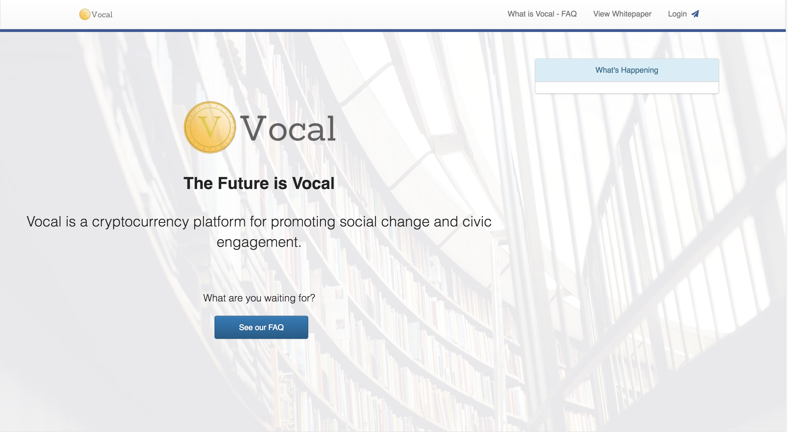
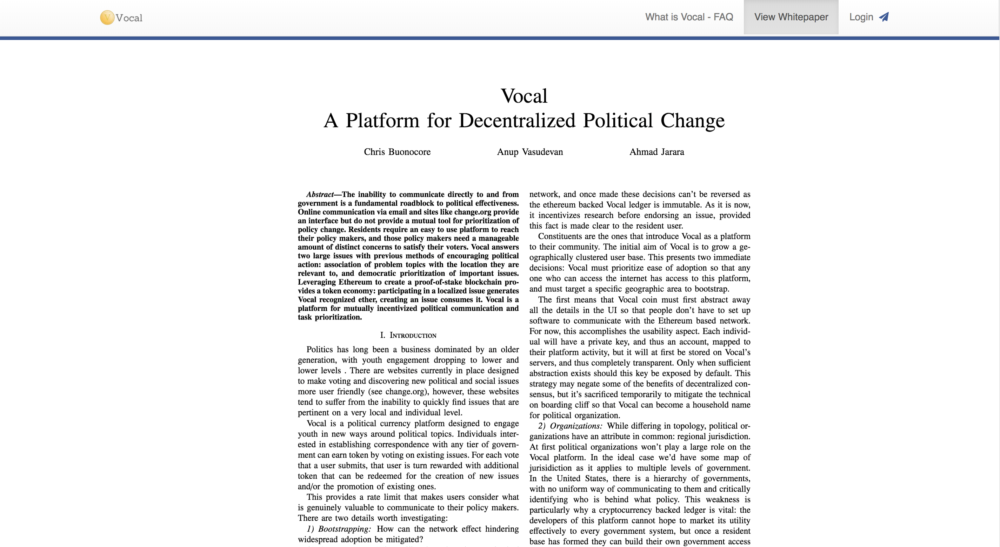
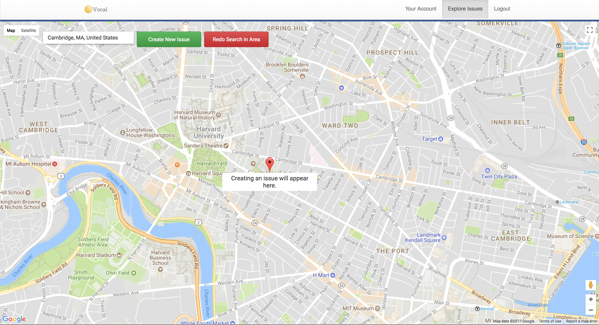
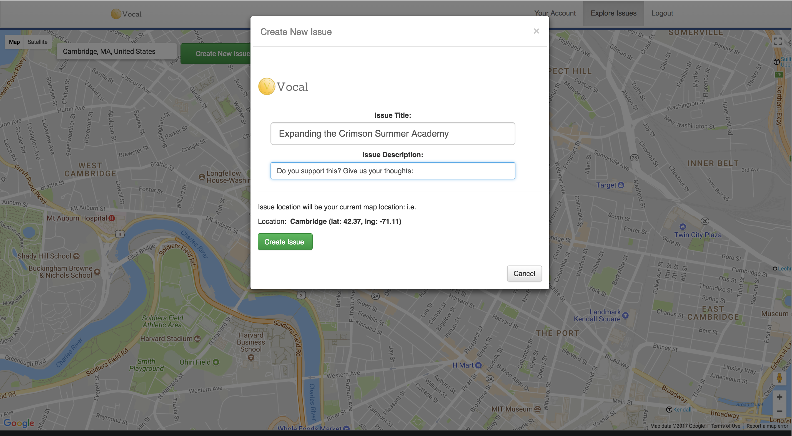
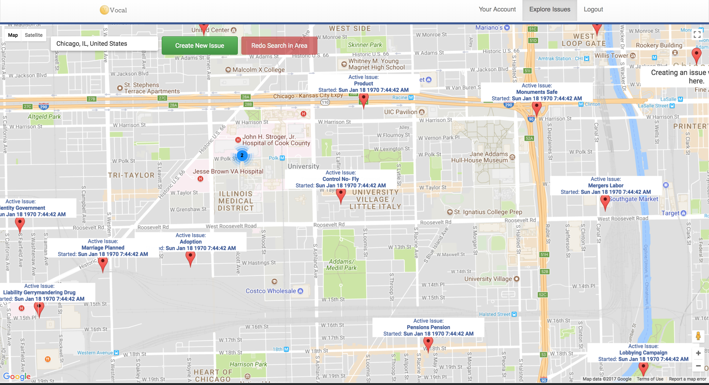
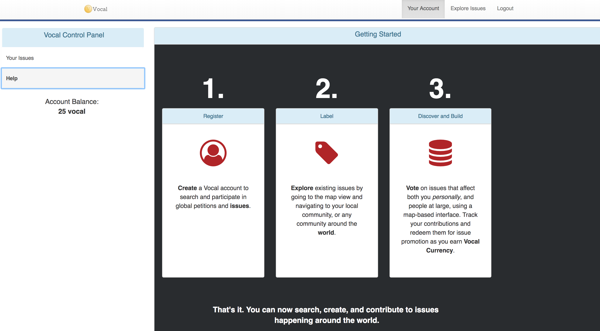

# Vocal Coin
A Distributed Political Currency.
---

Vocal is a currency and economy for promoting social change and civic engagement.

We have a running open beta website at <a href="https://www.vocalcoin.com">vocalcoin.com</a>

Simply create a new account (email and pass) and you will get started with 50 Vocal coin.

### What Vocal Solves:

- Engagement in politics is declining in younger demographics, engaging in political issues can seem intimidating, and sometimes not immediately accessible*.
- Often little transparency into others opinions and issues happening around me.
- Lack of a universal incentive system for political participation. We now propose/create that system through the use of Vocal coin - which can be redeemed for agenda promotion, issue creation (and other things to come) through a traceable currency.
- No widely accessible platform for political engagement and discovery on a local / map scale.
- Yelp-like platform enables map-search of active political issues. Quickly and easily find the issues that are most pertinent to you and your community, without having to sift through a huge world of political agendas and issues.

<i>*citation to come.</i>

### How it works:

<ol>
    <li>User signs up for a vocal account (this will automatically create a 'Vocal' wallet for that user that is either owned by them or managed by the Vocal platform) </li>
    <li>User earns Vocal coin by casting votes on particular government or other individuals' issues</li>
    <li>User redeems those vocal token for promoting his or her own initiatives (and/or social credit i.e. user gains publicity). Other opportunities for redemption can be possible in the future.</li>
    <li>Governments can also promote and add issues that they want information about from local communities, questions such as 'What would be the most valuable improvement to this town? Or should we make this investment?'</li>
</ol>

Vocal is not an investment vehicle, and is earned and spent by the individuals of the Vocal platform themselves. Currently Vocal can be earned by voting on existing issues (+5 Vocal per vote) and spent by creating new issues which you can track publicly (-50 Vocal). 

Create an account at <a href="https://www.vocalcoin.com">vocalcoin.com</a> to get started.

### Screenshots

<b>Vocal Home Page</b> 

<b>Vocal Whitepaper/Proposal on Website</b> 

<b>Vocal Create Issue on Location (City: Cambridge)</b> 

<b>Vocal Create Issue Dialog (City: Cambridge)</b> 

<b>Vocal Search (Sample Issues - Chicago)</b> 

<b>Vocal Help</b> 

### Demo Video

<a target="_blank" href="https://youtu.be/-_xxKBeUTdg">Original Demo Video</a>

### Future Work

- Better sorting/searching/filtering of issues on the map. i.e. finding by categories or creators.
- Implement remaining use cases for Vocal coin (other spending and earning opportunities).
- Interaction/Trading between users
- Improve UI / Remaining Beta Bug Fixes

## Repository Contents:
* /slidedeck - Contains the pitch slidedeck for Vocal Coin.
* /smartcontracts - NEP-5 smart contract files for Vocal Coin.
* /whitepaper - vocal whitepaper tex and build output files such as the pdf.
* /vocal - Front end and server code.
* /assets - other images/resources used for github and presentation purposes.

### Useful Links:
* https://medium.com/@tacomanator/environments-with-create-react-app-7b645312c09d
* https://fabric-sdk-node.github.io/release-1.4/index.html
* 